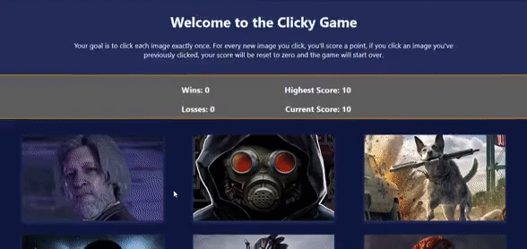

# Clicky Game
## a memory game using React
### React/Javascript

Notes For Running the App
==============================
The deployed game can be found here: 

APP FUNCTIONALITY
=====================
--The player will be presented with 24 character cards, each with a different video game character depicted.

### Click!
--Clicking on a new character card will change that cards status to "clicked", shuffle the order of the cards, and add a point to your score. Clicking on a card that you have already clicked will result in a loss, your score will be reset to zero, all cards will be set back to "unclicked" and shuffled. A win requires the player to click all 24 cards exactly once. A High Score tracker will let you know how many you've managed to get right in a row. 

